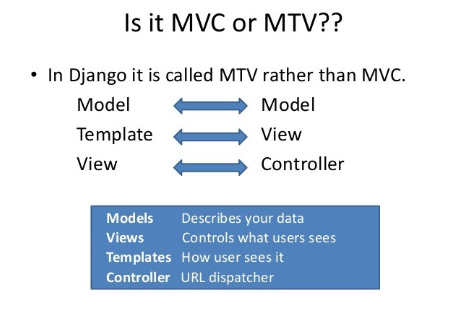
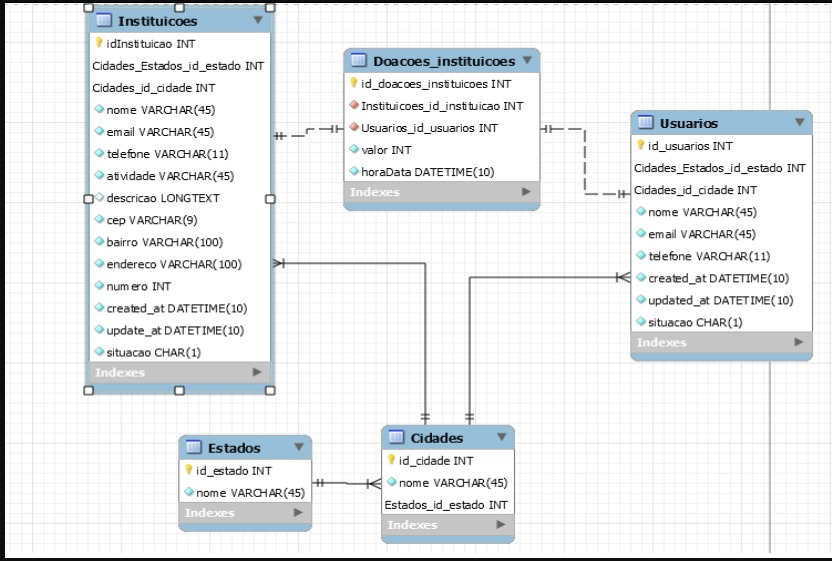

# Tricas-Django

<h3>Integrante</h3>
605778 | Breno S. Martins
602302 | Gustavo Batista Caetano
589748 | Richard Gabriel Siqueira Papa
608009 | Rafael de Carvalho Amorim
602124 | Gabriel Dal Fabbro Antoniazzi

<h2>Introdução</h2>
Decidimos criar um site de doações pra instituições caridade, órgãos, pet shops, pessoas carentes, entre outros.  Fizemos o planejamento de projeto, com isso, o grupo conseguiu ter um objetivo e decidir como seria o resultado esperado. Acreditamos que com o site, será possível um novo meio de facilitar e incentivar pessoas que possuem condições de ajudar, realizar doações de maneira pratica e funcional.

<h2>Projeto</h2>
	Quando estávamos pensando em o que tipo de site poderíamos criar, muitas ideias foram aparecendo, porém, teve uma que nós decidimos realizar pelo fato de ser algo bem interessante. Com isso, colocamos as ideias no “papel” e fomos aprimorando com as opiniões e votações de todos os membros do grupo. Foi decidido realizar um site de doações, como atualmente estamos na era da informação, acreditamos que informar ao mundo que pessoas carentes estão precisando de ajuda, podemos estar salvando vidas.

<h2>Arquitetura de software</h2>
O desenvolvimento do site foi na Linguagem Python/Django. Respeitando os requisitos impostos a nós, sendo eles; usar a arquitetura MVC, que em Djando a sigla correta é MTV, trocando o View (MVC) por Template (MTV) e Controller (MVC) por View (MTV), conforme a imagem abaixo:

<h2>Entidades</h2>
As entidades presentes do nosso projeto são, os estados, cidades, instituições, pessoas e doações. Pensamento em um futuro agregar em nosso projeto entidades de doação exteriores.

Interação com banco e relação 1-N e N-N:
Em nosso projeto, utilizamos o relacionamento 1-N e N-N como está mostrado nas imagens abaixo:

A entidade “Doações”, se dá a partir da relação N-N entre as “Instituições” e “Usuários”. Sendo assim, um usuário poderá realizar uma doação para N instituições e uma Instituição poderá receber de N usuários.
	As relações de 1-N são: 
    - Estado → Cidades
    - Cidades → Usuários
    - Cidades → Instituições
    - Usuários → Doações → Instituições

<h2>Conclusão</h2>
	Por fim, nosso projeto tem como principal objetivo centralizar todas Instituição de caridade da região do usuário em um aplicativo. Além disso, nossa intenção é promover programas de doação que são realizados pela sociedade. Outra finalidade do projeto é facilitar meios de doações às pessoas que desejam realizá-las. 	
Um exemplo de um aplicativo atual que tem a mesma regra de negócio é o iFood, ele permite que vários restaurantes divulguem seus produtos em sua plataforma. Com isso, facilita o usuário na compra dos lanches, pizzas e outros produtos desses restaurantes. 
Eles também contam com publicações, descontos e outros sistemas de negócio, porém, algumas dessas coisas não tem como ser aplicadas em nosso sistema, pois, são áreas distintas. 
